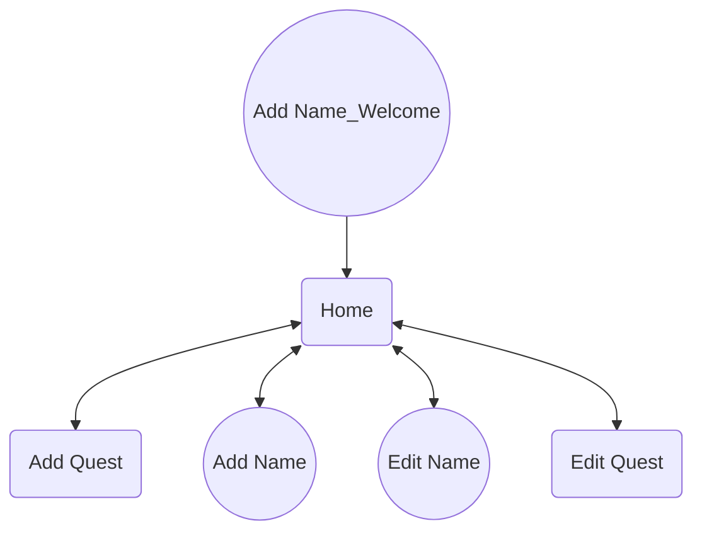
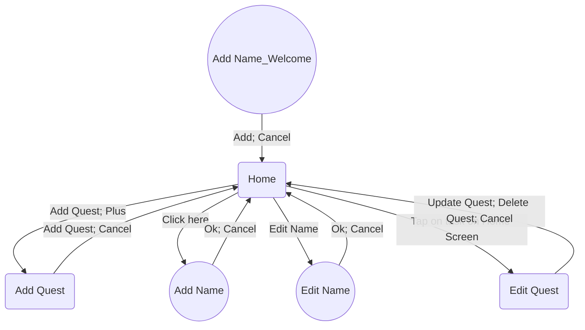

# Product Documentation: Screen & Dialogues Management

This document provides a comprehensive overview of the various screens and dialogues associated with our product, as well as the possible transitions between them.

## Table of Contents

1. [Introduction](#introduction)
2. [Screens](#screens)
3. [Dialogues](#dialogues)
4. [Flowchart](#flowchart)
5. [Updates & Revisions](#updates-revisions)

## Introduction

Understanding the architecture of our application's UI is crucial for both developers and stakeholders. This documentation serves as a guide to the screen and dialogues' names and their interactions. 

## Screens

- **Home**: Main screen from which users can navigate to various functionalities.
- **Add Quest**: This screen allows users to create a new quest. Upon entering this screen, users are presented with a form that prompts them to input the quest title, set a deadline, gold reward, and add a brief description. Upon filling in the necessary details, users can preview their quest and, once satisfied, can save it to their quest list. A confirmation dialogue appears once the quest is successfully added, and users then return to the Home screen where they can proceed to add another quest
- **Edit Quest**: The "Edit Quest" screen is designed for users who need to modify the details of an existing quest. Upon accessing this screen, the system fetches and displays the current details of the selected quest. Users can then make adjustments to fields such as the quest name, duration, description, type, priority level, and assigned members or groups. As changes are made, a real-time preview reflects the modifications. An "Update" button is prominently placed for users to confirm their edits, while a "Discard Changes" option allows users to revert to the original quest details. Upon successfully updating the quest, a confirmation message appears, informing users of the applied changes and giving them the option to either edit another quest or navigate back to the Home screen.

### Home Screen
Conceived in https://github.com/sadevana/best-to-do-ever/issues/6, https://github.com/sadevana/best-to-do-ever/issues/7
A space should be added at the end of the quest list to allow for additional scrolling.
The space should be sufficient to ensure that the character (girl) does not obstruct the view of the last quest item when scrolling to the bottom.

#### Basic task card
#### Basic task card: Appearance & Logic
The "tick" button should change its appearance based on task completion ([Task: done])
When the "tick" button is pressed task should change its done status to the opposite: done-> undone; undone -> done.

time\date ([Task:due date]) is displayed
time is HH:mm format
date is in DD.MM format
More on it in #

Add gold to ([Loot: total_gold]) for completing a task.
Gold awarded based on ([Task:Reward:Gold]) field
Deduct gold from ([Loot: total_gold]) for uncompleting a task
Total gold ([Loot: total_gold]) amount displayed on the home screen should be updated accordingly
NB: I am aware that in the future users can go negative with deductions. We will think about it in time

The Date field should only accept valid date formats and not allow letter characters.
The Time field should only accept valid time formats and reject letter characters.
The Gold field should only accept numeric values, it should not accept letter characters.
Max Gold: 9 999 999 999 https://github.com/sadevana/best-to-do-ever/issues/16

If the user taps the card, the Edit task screen opens.

When creating a task without a specified time, the task should: Not display any time, indicating that it doesn't have a specific due time.

#### Basic task card: How user enters
The user sees task cards on the Home screen

## Dialogues
- **Add Name_Welcome**: This dialogue appears when a user opens the application for the first time. It prompts the user to optionally provide a nickname.
- **Add Name**: The "Add Name" dialogue emerges when a user intends to add a new nickname to the system (they shouldn't provide a nickname beforehand). After providing the necessary details, a simple "Add" button confirms the entry, while a "Cancel" option lets users exit without saving. Upon successful addition, a brief confirmation message is displayed.
- **Edit Name**: The "Edit Name" dialogue is activated when users wish to modify an existing name entry in the system. Within this dialogue, the current name details are pre-populated, allowing users to easily spot and make amendments. Fields for the first name, last name, and if applicable, middle name or initial, are present, along with any previously recorded nickname or title (e.g., Mr., Mrs., Dr.). Users can seamlessly make their desired changes and then confirm with an "Update" button. Should they change their mind or make an error, a "Reset" option reverts the fields to their original state. Additionally, a "Cancel" button allows exit without applying any changes. Upon successful modification, a notification confirms the name update.

## Flowchart

To visualize the transitions and interactions between screens and dialogues, refer to the flowchart below:

## Updates & Revisions

- **Version 1.0 (12 October 2023)**: Initial release of the documentation.

# Mermaid Chart is not supported by GitHub yet

